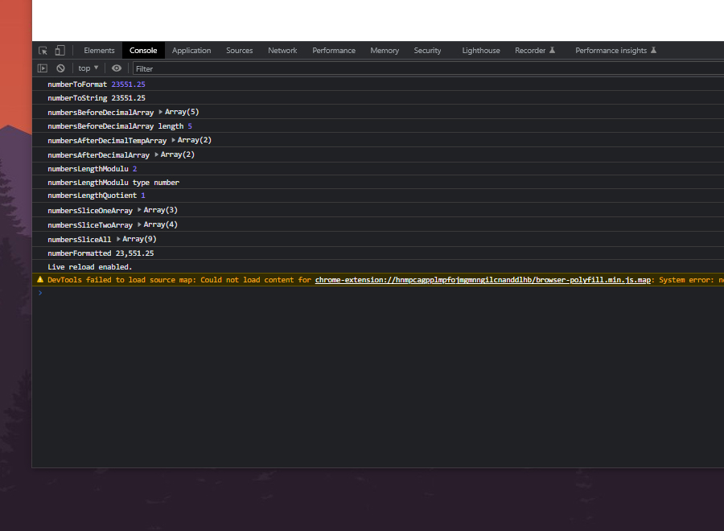

# Number Formatting With Commas

To practice more with problem solving using JavaScript, I created this small-project where I need to format a Float number into a String but with the right placement of commas. For example below.

25000.25 to 25,000.25
 
4021.75 to 4,021.75
 
253687893.35 to 253,687,893.35

I think, there are plenty of solutions out there but I challenge myself to create my own solution and I was really happy with the solution I created.

 

### Used technologies
 

